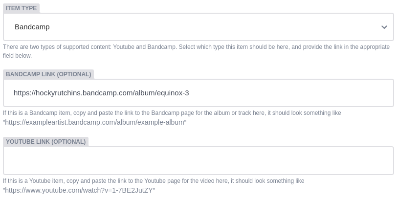
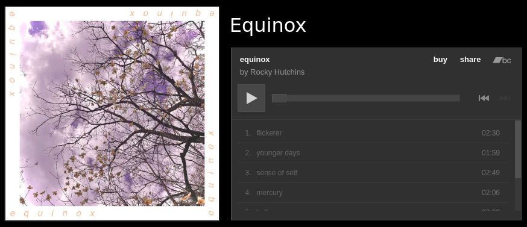
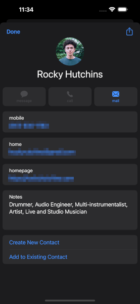
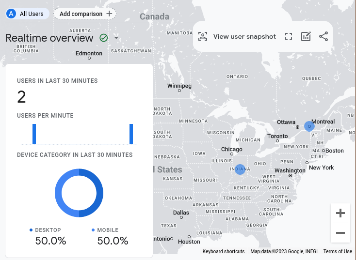
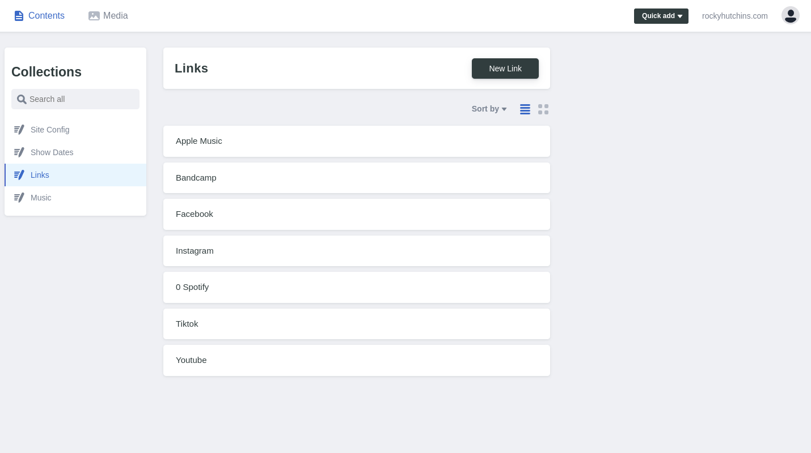
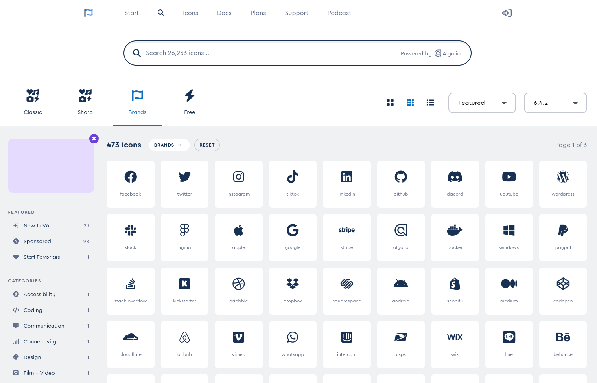

# Rocky Hutchins
View this site at [rockyhutchins.com](https://rockyhutchins.com)

Rocky Hutchins is an incredibly talented musician and producer. This website is designed to showcase his work and be a tool for networking and promoting himself. I created a unique design from scratch for this site, and I'm really happy with how it turned out. In addition to the design, I implemented lots of useful features and functionality into the site. 

## Features
Some notable features of the site include: 

### Web Scraping of Bandcamp and Youtube
The music page of the site pulls its data from Bandcamp and Youtube. Adding one of these items to the page is as simple as copy-and-pasting the link into the CMS. Hugo then fetches the page from Bandcamp or Youtube and pulls out all of the information that we need such as the album art, the video and album IDs for embedded players, etc.

#### CMS input:

#### Output on website:

### Automatic Contact Card Generation
One of the primary objectives for this site is to help the client in networking with people. To aid in this, I created a system that automatically puts the client's contact information into a virtual contact card format (.vcf) with an quick download link. This way, the client can simply have someone pull up the website on their phone and download the contact card, and now that person has the client's full name, phone number, email, notes about their skills, and even a picture to help them remember the client and make sure they can find them in the future. The contact information for the website can all be updated from the same place, so if it changes in the future, the website and the contact card will stay consistent with each other.

### Device Recognition for Contact Import Instructions
When downloading the contact card, the site detects what browser the user is using and displays the relevant instructions for how to download and import the contact information on that browser.

### Link Forwarding
This site serves as a central place for the client to link to all other platforms that they are on. I added an additional feature that creates an easy-to-remember URL that will forward people to those platforms automatically. For instance, if the client adds a link to their Spotify account, a page is automatically created at [rockyhutchins.com/spotify](https://rockyhutchins.com/spotify). This makes it easy to quickly send someone a link to any of your platforms without having to look it up.

### Google Analytics
This site is connected to Google Analytics to track traffic and gain insights.

### User-Friendly Content Management System 
Decap CMS provides a great interface that's easy to use so the client can update the site with ease.

### User-Configurable icons for links
The site is hooked up to both [Bootstrap Icons(https://icons.getbootstrap.com/) and [FontAwesome](https://fontawesome.com/) so that the client can quickly and easily add an icon to any link they need! 

### CSS Purging
PurgeCSS is integrated into Hugo such that we can automatically optimize our CSS, which is especially helpful when using Bootstrap. This provides a huge boost in performance by removing any extra lines of CSS that we don't need, making the website faster and more responsive.

## Technologies used: 
- [Hugo](https://gohugo.io/)
- [Bootstrap](https://getbootstrap.com/)
- [Decap CMS](https://decapcms.org/)
- [NPM](https://www.npmjs.com/)
- [PurgeCSS](https://purgecss.com/)

